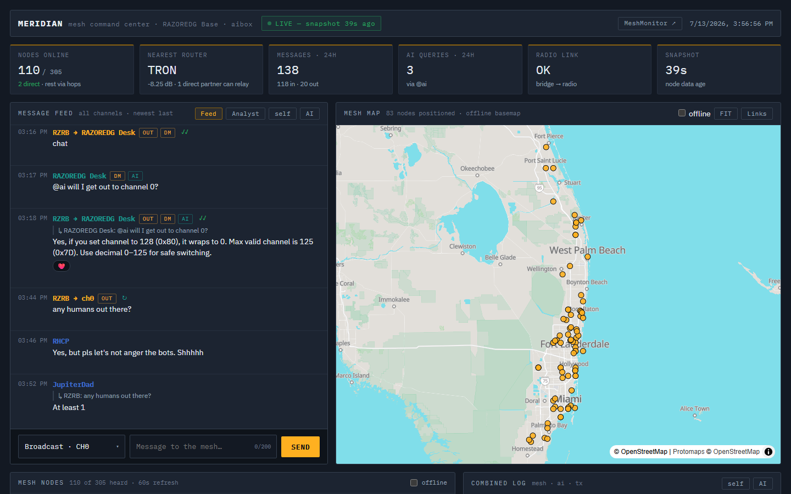
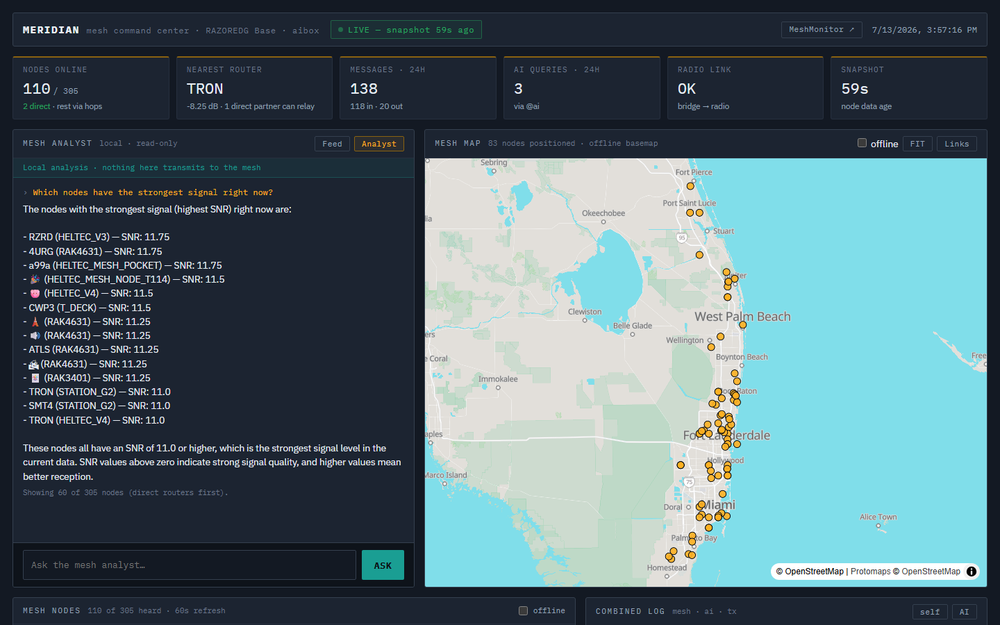
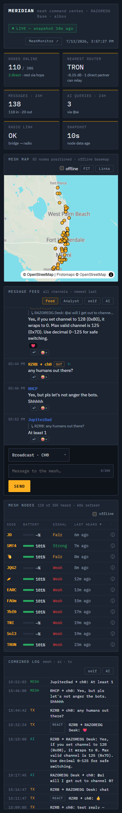
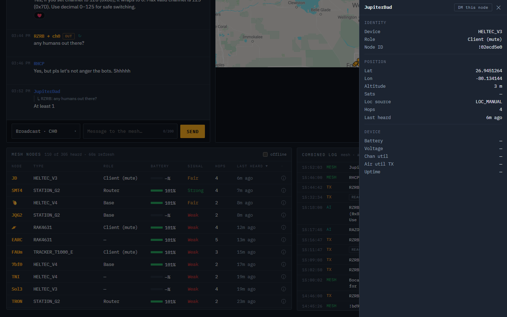

# Meridian — Mesh Command Center

**Meridian** is a self-hosted, **offline-first** command center for a
[Meshtastic](https://meshtastic.org) mesh network — the companion UI to
[mesh-ai-bridge](https://github.com/aebconsulting/mesh-ai-bridge), built for the NOMAD
off-grid stack. (Repo/image name: `nomad-mesh-dashboard`.)

It reads the bridge's SQLite database **read-only** and transmits back through the
bridge's token-gated HTTP API, so it never opens the radio itself (the bridge stays the
single radio owner). Every asset — map tiles, fonts, JavaScript — is served locally, so
the whole thing works with **no internet**.



## What it shows

- **Mesh vitals strip** — nodes online, your nearest relay (router-preferred, with a
  direct-partner count so you know a channel send will actually be heard), 24h traffic,
  AI queries, radio-link state, and data freshness — glanceable, words not just colors.
- **Live message feed** with a send box — broadcast or DM any node (searchable recipient
  picker), `self` / `AI` restrict-to filters, and smart follow that never yanks you out
  of history.
- **Honest delivery states** on every send — ✓ radio accepted, ↻ relayed by a neighbor,
  ✓✓ acknowledged end-to-end, ✗ failed with the radio's reason. The vocabulary never
  claims "delivered": a radio ACK is not a human receipt.
- **Replies & reactions** — quoted Discord-style replies and emoji tapbacks, carried as
  first-class Meshtastic packets (official apps render them too). Inbound tapbacks stack
  as chips under the message they answer.
- **Mesh analyst** — a second tab that asks a *local* LLM about your mesh: signal, nodes,
  whether a message went through. Read-only by construction (no path to the send API),
  fed only public mesh data, and it never transmits.
- **Node map** — MapLibre GL over an offline vector basemap (PMTiles); positions live,
  hover popups, click-through to detail. Clicking a node name in the table flies the map
  to it with a selection ring.
- **Node table** — sortable by device type, role, battery, signal, hops, last-heard, with
  an **offline** toggle.
- **Combined log** — a console-style tail of mesh / AI / TX traffic, reactions tagged.
- **Per-node detail drawer** — identity, position quality, device metrics, every
  telemetry group the node reports, recent weather history, one-tap **DM**.

<p align="center">
  
</p>
<p align="center">
  
  &nbsp;&nbsp;
  
</p>

## How it works

```
 Meshtastic radio ──serial/TCP── mesh-ai-bridge ──writes── memory.db (SQLite, WAL)
                                        │                        │
                                        │ token-gated           │ read-only
                                        │ /api/send             │ (mode=ro)
                                        ▼                        ▼
 browser ──/api/send (validated,──▶ mesh-dashboard backend (FastAPI) ──serves──▶ React SPA
           rate-limited, CSRF)         reads DB, proxies sends, serves the
                                       offline MapLibre basemap
```

The bridge writes every message and a per-node telemetry snapshot to `memory.db` in WAL
mode; the dashboard opens that same file read-only and never blocks the writer. Sending a
message goes **browser → dashboard → bridge**: the dashboard validates and rate-limits the
request and forwards it to the bridge's `/api/send` with the shared token, which the
browser never sees.

## Requirements

- A running [mesh-ai-bridge](https://github.com/aebconsulting/mesh-ai-bridge) connected to
  a Meshtastic radio. Use **v6+** for the WAL database and the send API; **v9+** adds the
  full per-node telemetry the detail drawer surfaces; **v11+** adds per-message delivery
  tracking (the ✓/↻/✓✓/✗ glyphs); **v12+** adds replies & reactions. Every feature
  degrades gracefully against an older bridge — the UI simply hides what the data can't
  support.
- Docker.
- (Optional) an offline vector basemap for the map panel — see below.

## Run

The dashboard and the bridge share the bridge's data directory (for `memory.db`) and talk
over a Docker network. Example:

```bash
docker run -d --name mesh-dashboard \
  --network your-mesh-net \
  -p 8420:8080 \
  -v /opt/mesh-ai-bridge:/opt/mesh-ai-bridge:ro \
  -v /path/to/maps:/maps-data:ro \
  -e MEM_DB=/opt/mesh-ai-bridge/memory.db \
  -e BRIDGE_URL=http://mesh-ai-bridge:8700 \
  -e SEND_TOKEN="$(cat /opt/mesh-ai-bridge/.send_token)" \
  ghcr.io/aebconsulting/nomad-mesh-dashboard:latest
```

> The `memory.db` mount must be the bridge's actual data dir so WAL sidecar files are
> visible. The app enforces read-only at the SQLite connection regardless of the mount
> flag. `SEND_TOKEN` must match the bridge's.

Runs on NOMAD as a custom app (host port in the 8400–8499 range) the same way — set the
env above and mount the two directories.

## Configuration

| Variable | Default | Purpose |
|---|---|---|
| `MEM_DB` | `/opt/mesh-ai-bridge/memory.db` | Path to the bridge's SQLite DB (opened read-only). |
| `BRIDGE_URL` | `http://nomad_custom_mesh_ai_bridge:8700` | Base URL of the bridge's send API. |
| `SEND_TOKEN` | *(empty)* | Shared secret for the bridge send API. Required to transmit; must match the bridge. Never sent to the browser. |
| `MAPS_DIR` | `/maps-data` | Offline basemap directory (see below). |
| `BASEMAP_PMTILES` | `20260704.pmtiles` | PMTiles archive filename under `MAPS_DIR/pmtiles`. |
| `IMAGES_DIR` | `/images` | Optional directory of generated images (gallery panel; hidden in the UI by default). |
| `TRUSTED_PROXY_CIDRS` | `172.16.0.0/12,127.0.0.1/32` | Peer networks whose `X-Forwarded-For` is trusted for per-client rate limiting behind a reverse proxy. |

## Offline basemap

The map renders a [Protomaps](https://protomaps.com) / MapLibre vector basemap served
entirely from `MAPS_DIR`, expected to contain:

```
MAPS_DIR/
  nomad-base-styles.json          # MapLibre style
  pmtiles/<BASEMAP_PMTILES>       # the vector tile archive (PMTiles v3)
  basemaps-assets/fonts/…         # glyph PBFs
  basemaps-assets/sprites/…       # sprite sheet
```

NOMAD ships this basemap set; you can also build your own PMTiles from
[protomaps.com](https://protomaps.com). Without `MAPS_DIR`, the map panel won't render —
the rest of the dashboard works normally.

## Security model

- **Read-only DB** — connections use `file:…?mode=ro` plus `PRAGMA query_only=1`; the app
  can never write the mesh database.
- **Token-gated send** — the `SEND_TOKEN` lives only server-side. The browser POSTs to the
  dashboard (which validates length/channel/destination and rate-limits to 6/min per
  client, and requires an `X-Mesh-Dashboard` header as a CSRF control); the dashboard
  forwards to the bridge with the token.
- **No app-level auth by design** — the intended trust boundary is your LAN/VPN. For remote
  access, put it behind a VPN or a reverse proxy that authenticates.
- **Hardened image** — runs as non-root (`1000:20`), exposes a single port, and bakes no
  secrets into any layer.

## Development

```bash
# backend
cd backend && python -m venv .venv && .venv/bin/pip install -r requirements-dev.txt && .venv/bin/pytest

# frontend (proxies /api to http://127.0.0.1:8000)
cd frontend && npm install && npm run dev

# production image
docker build -t nomad-mesh-dashboard .
```

## License

MIT — see [LICENSE](LICENSE).
